# Introduction to FiddleFiddle

FiddleFiddle (피들피들) 은 .NET 기반의 Fiddler 확장 프로젝트 입니다. Fiddler 는 웹 디버깅(Web Debugging)용도로 주로 사용되는 툴인데요. 저 코마는 이 기능을 확장하여 API Request 를 자동 보관하는 확장 프로그램과 서버를 개발하였습니다.

## Dev Stack 및 Communication

- Stack
  - Django
  - Rest Framework
  - C#
  - WPF
  - Postgresql (hstore, citext)
    - citext : case insensitive string type
    - hstore : sets of key/value pairs 

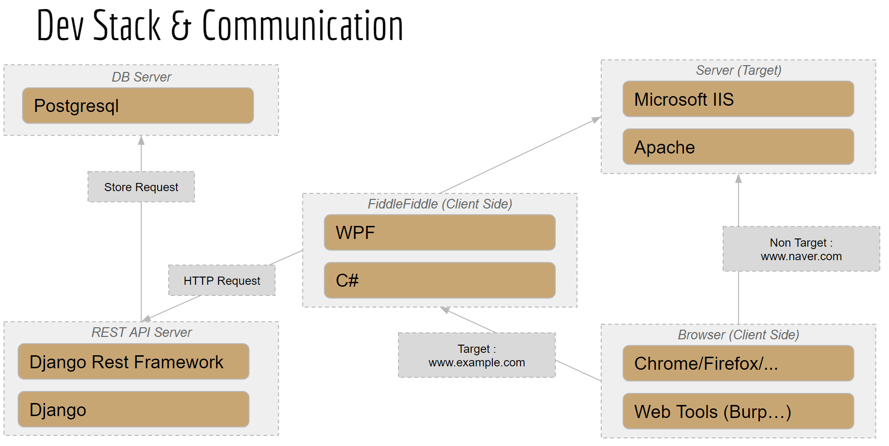

## Toc

|목차|
|---|
| Change Log |
| 기능 |
| 수집 항목 명세 |
| 구동 방법 |
| 효과 |
| 설치 | 
| 핵심 포인트 | 
| 효과 | 
| TODO |
| 부록 - 프로그램 라이프사이클 |


## Change Log

- 2019 
  - 12 Dec : Release 배포 예정
  - 06 June : 현재 계정으로 Repo 이관 (From gbkim1988 to code-machina)
- 2018
  - 18 June : Beta 버전
  - 5 March : Alpha 버전

## 기능

- Posgtresql 를 데이터베이스로 사용
- Django Rest API 를 제공
- Fiddler 실행 시 로그인 팝업 제공
  - JWT 기반의 인증을 통해 Access Control
- 도메인별 선택적 Request 수집 옵션 제공
- Web Request UID 기능을 제공
  - 중복 수집을 방지

## 수집 항목 명세

수집된 Web Request 데이터는 아래와 같은 포맷으로 저장됩니다.

```json
{
id: 3,
created: "2019-07-25T03:55:58.896464Z",
modfied: "2019-07-25T03:55:58.896464Z",
req_header: {
Host: "www.example.com",
Accept: "text/html,application/xhtml+xml,application/xml;q=0.9,image/webp,image/apng,*/*;q=0.8,application/signed-exchange;v=b3",
Connection: "keep-alive",
User-Agent: "Mozilla/5.0 (Windows NT 10.0; Win64; x64) AppleWebKit/537.36 (KHTML, like Gecko) Chrome/75.0.3770.100 Safari/537.36",
Accept-Encoding: "gzip, deflate",
Accept-Language: "ko-KR,ko;q=0.9,en-US;q=0.8,en;q=0.7",
Upgrade-Insecure-Requests: "1"
},
method: "GET",
full_url: "http://www.example.com/?param1=value1&param2=value23",
url: "/?param1=value1&param2=value23",
url_param: {
param1: "dmFsdWUx",
param2: "dmFsdWUyMw=="
},
body_param: { },
client_ip: "127.0.0.1",
client_port: 20685,
client_process: "chrome:8628",
res_header:  {
Date: "Thu, 25 Jul 2019 03:55:50 GMT",
Etag: ""1541025663"",
Vary: "Accept-Encoding",
Server: "ECS (nyb/1D13)",
Expires: "Thu, 01 Aug 2019 03:55:50 GMT",
X-Cache: "HIT",
Content-Type: "text/html; charset=UTF-8",
Accept-Ranges: "bytes",
Cache-Control: "max-age=604800",
Last-Modified: "Fri, 09 Aug 2013 23:54:35 GMT",
Content-Length: "1270"
},
comment: "",
is_https: false,
has_body: false,
server_ip: "93.184.216.34",
server_port: 80,
hostname: "www.example.com",
url_key: "http_www.example.com",
param_hash_key: "39a3f4c67aa7ee27e1a02a04d9ef8da8",
param_key: "http_www.example.com|param1|param2",
res_code: 200
},
```

- 저장 필드 요약

|No.|Field Name|Description|
|:---:|:---:|:---:|
|1|id| Unique ID for Postgresql|
|2|created | 데이터 생성 시간 |
|3|req_header| HTTP Request Header |
|4|method| HTTP Method |
|5|full_url| 호스트 이름 + Uri |
|6|url| uri |
|7|url_param|주소표시줄 상에 표기되는 GET 성 파라미터|
|8|body_param| POST 등의 메서드로 전달되는 HTTP BODY 파라미터|
|9|client_ip| 클라이언트 아이피 (Fiddler를 프록시 모드로 하여 중계할 때 유용)|
|10|client_port| 클라이언트 포트| 
|11|client_process| 클라이언트 프로세스|
|12|res_header| HTTP Response Header|
|13|comment| 주석(작업자가 주석을 남기도록 할당)|
|14|is_https| HTTPS 통신 여부 체크 |
|15|has_body| Request 상의 HTTP BODY 에 데이터가 있는지 체크|
|16|server_ip| 원격 통신 아이피 (원격 서버의 아이피)|
|17|server_port| 원격 통신 포트|
|18|hostname| DNS 혹은 호스트 파일 상에 등록된 도메인 이름|
|19|**url_key**| request 의 Uniqueness 를 구분하기 위한 보조키 |
|20|param_hash_key|`param_key` 를 해쉬화 한 값 (중복 체크 속도가 좋다.)|
|21|param_key|`param_hash_key` 의 실제 값|
|22|res_code| 서버 응답코드|

### 구동 방법

> 피들러 구동 전에 deus_rest Django 웹 서비스를 구동한다. (설치 방법을 참조)

윈도우 시작에서 Fiddler 를 실행, FiddleFiddle 확장 기능이 설치된 경우 로그온 화면이 출력

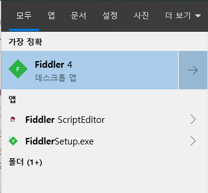

#### 로그인 화면

로그인 화면이 아래와 같이 출력되며 인증을 해야, 웹 리퀘스트 수집이 가능

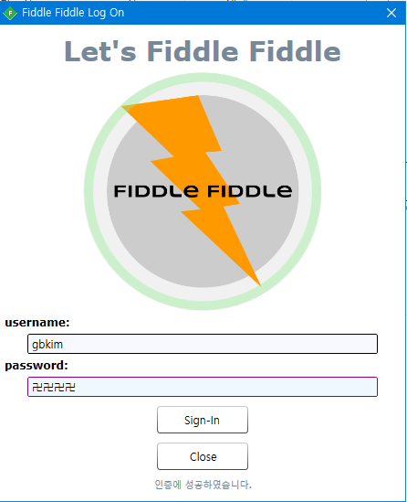

#### 관리 패널 (Control Panel)

피들피들은 수집을 위해 도메인 정보를 입력 받는다. 등록된 도메인에 대해서 수집을 하므로 이에 유의한다.

Inspector 와 같은 툴 리스트 중에서 FiddleFiddle 을 선택한다.

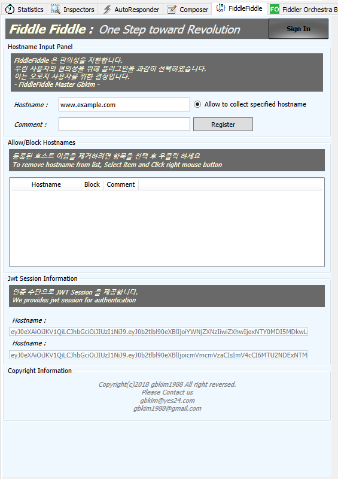

#### 호스트 이름을 등록 (Register your hostname)

`www.example.com` 을 등록 한 뒤에 수집 테스트를 한다.

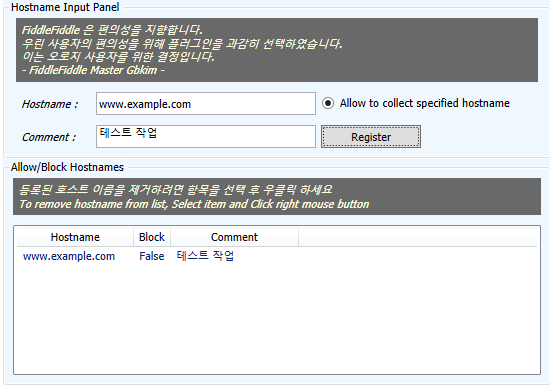

```bash
curl http://www.example.com/where/am/i?param1=value1&param2=value2
```

#### JWT Auth Key

정상적으로 로그인한 경우 JWT 키가 발급된다. 해당 키는 일정 주기로 Refresh 되며 프로그램을 종료하면 키가 만료된다.

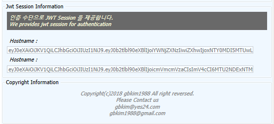

## 효과

- 모의해킹/QA/테스트 데이터를 중복없이 보관
- 점검 기록을 재사용
- Static Resource 제한
- Net Uri 리스트업
- 전수 리스트 목록 도출
- Web Fuzzing 솔루션 구축의 기반 작업

## 설치

### Host 파일 등록

호스트 파일을 등록한다.

```file
# c:/windows/etc/drivers/hosts 
127.0.0.1 yes24.cert.com
```

### Postgresql 구동

- test DB 생성
- postgres 확장 기능 (hstore, citext 설정)

### Django 구동

```bash
cd ./deus_rest # Rest 프로젝트 폴더로 이동
pip install -r ./requirements.txt # Dependency Module 설치
python manage.py migrate # DB 초기화
python manage.py createsuperuser # 관리자 계정 생성
python manage.py runserver 
```

Rest Open API 화면

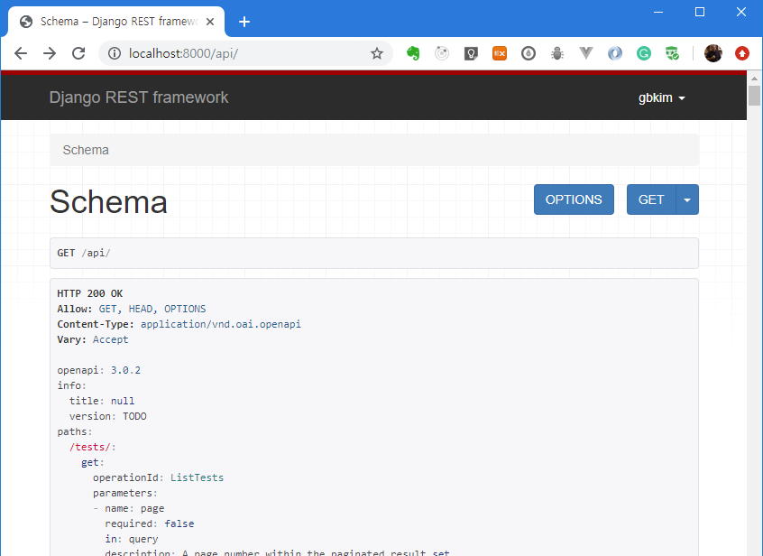

호스트 `wwww.example.com` 의 수집 내역 샘플

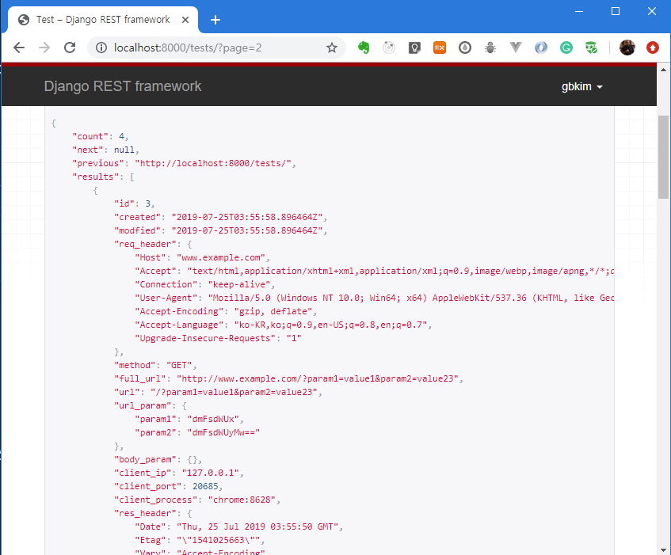

Json 뷰

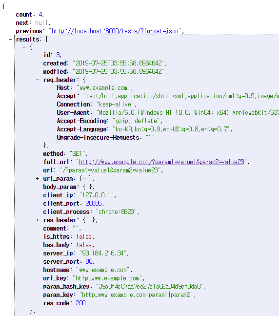

#### FiddleFiddle 구동

- 요구사항
  - Visual Studio 2015 (Express) 이상 설치
  - Fiddler 설치

`FiddleFiddle.sln` 파일 실행 

`빌드 이벤트` 에서 아래의 구문을 `빌드 후 이벤트 명령줄`에 입력

```bash
copy "$(TargetDir)\*.dll" "C:\Users\cert\Documents\Fiddler2\Scripts"
```

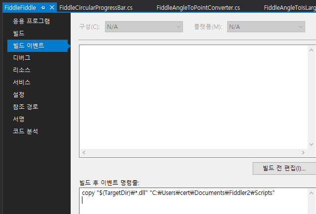

`Build` 버튼 클릭 후 빌드 성공 시 Fiddler 실행

## 핵심 포인트

### 중복 방지 기능

Uri, Parameter Name 을 키로 변환하여 보관하며 이를 통해 동일한 Parameter Name 리스트에 대해 동일한 Unique ID 를 부여합니다.

#### 케이스 1

파라미터 목록은 동일하나 파라미터 순서가 다른 경우, 이름 정렬을 통해 단일한 케이스로 식별

|No|param order| value order |
|:---:|:---:|:---:|
| case1 | param1, param2, param3 | value1, value2, value3 |
| case2 | param1, param3, param2 | value1, value3, value2 |

```bash
curl http://www.example.com/where/are/we?param1=value1&param2=value&param3=value3
```

```bash
curl http://www.example.com/where/are/we?param1=value1&param3=value3&param2=value
```


#### 케이스 2

파라미터 목록은 동일하나, 그 값이 다른 경우 동일한 케이스로 취급

|No|param order| value order |
|:---:|:---:|:---:|
| case1 | param1, param2, param3 | value1, value2, value3 |
| case2 | param1, param2, param3 | value1, value3, value2 |


## TO-DO

- 질의어를 이용한 검색 기능 강화
- Web Request Fuzzing 알고리즘 구현
- 분산-비동기 Task Queue 를 이용한 Web Fuzzer 아키텍처 
  - github.com/code-machina/xiired (쉬레드) 참고
- 자동화 리포트 데몬 추가
- 웹 관리 툴 구현 (MEVN)

## 부록 (Appendix)

### Life Cycle (라이프사이클)

이 프로세스를 그릴 당시 영어병에 걸려서 영어로 작성하였으나, 지금 보니 작문이 엉망이다.

#### OnLoad Logic

피들러는 플러그인/확장 프로그램 구동 시 OnLoad 메서드를 통해서 초기화(Initialization)를 한다. 따라서, OnLoad 시에 우리가 필요한 준비 절차를 마쳐야 한다. 

- 로컬 캐시 로드
  - 중복 Request 데이터 저장 요청을 막기 위해 Cache 를 사용한다.
  - 이 데이터는 나중에도 사용된다.
- 로그인
  - WPF 로 작업한 UI 화면 데이터를 출력한다. 
- Update Token
  - 인증이 완료될 경우 JWT 토큰이 발급되며 프로그램은 이를 통해 CURD 작업의 권한을 받는다.

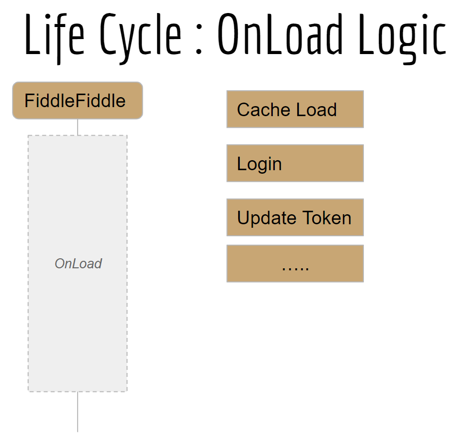

#### OnLoad Plugin

아래의 그림은 피들피들(Fiddle) 의 프로그램 라이프 사이클 이다.
JWT 인증 과정이 포함되어 있다.

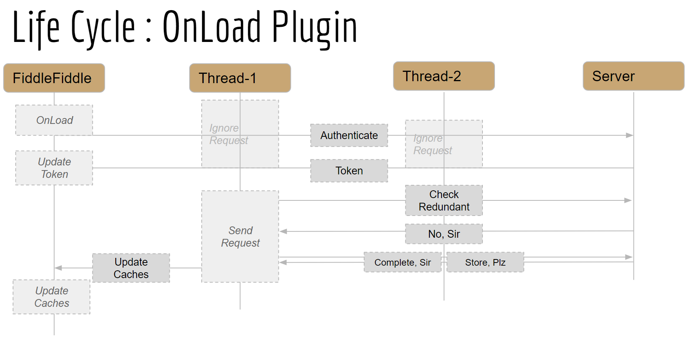

#### SendRequest And Cache Check

용어는 거창하지만 결국에는 반복적인 Update 요청이 발생하지 않도록 데이터를 Cache 처리하는 것을 말함. 이때, 멀티 쓰레드로 작업하였다.

우선, Send Request 부분의 절차는 아래와 같다.

|절차 구분|설명|
|:---:|:---:|
|절차-0 | MIME Type 을 체크하여 Static Resource 를 수집하지 않는다. |
|절차-1|중복 데이터 저장 시도(Try)를 막기 위해 로컬(클라이언트) Cache에서 체크한다.|
|절차-2|만약 Cache 에서 중복되지 않으면 저장 요청을 서버에 전송한다.|
|절차-3|만약 이미 저장된 Request 라면 서버에서 저장을 거부한다|
|절차-3-1|신규 Request 라면 서버에 저장한다.|

0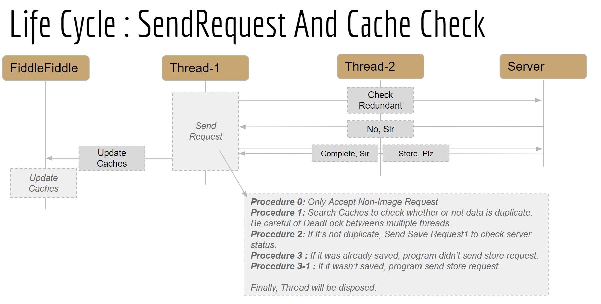
